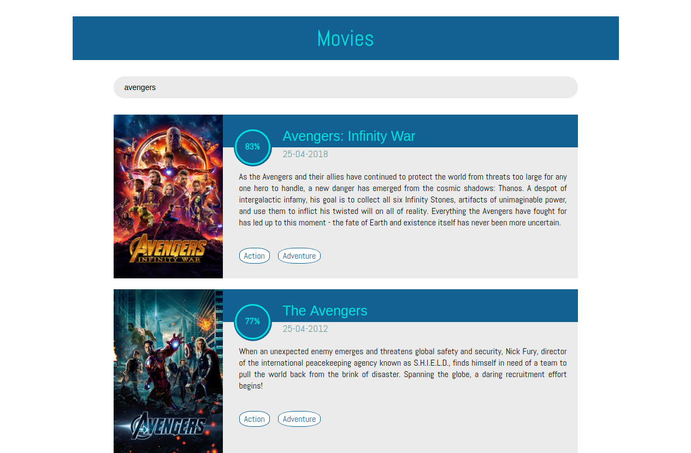
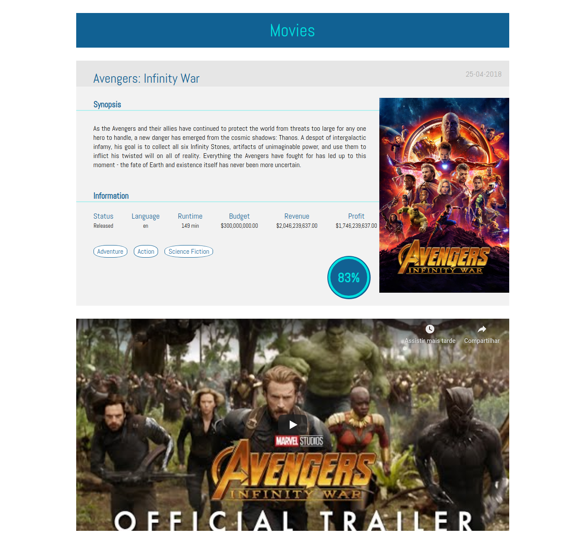

# Movies


#### This project is part of the web technical challenge proposed by Cubos Tecnologia. Implementation of a web app that uses the API of The Movie DB and allows you to search and see details of films in your catalog.

##### Technologies used: React and NodeJs.

***
##### View search movies:


##### View movie detail:


## Build project

##### Run backend
```
backend/
yarn dev
```

##### Run frontend-web
```
frontend/
yarn start
```
